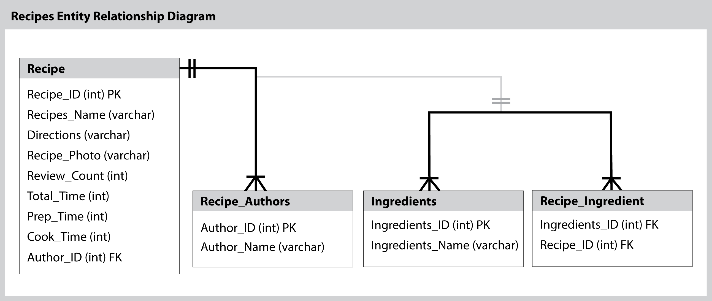

# SI507W19 Final Project

Angela Chih

[Link to this repository](https://github.com/ahcdesign/SI507W19FinalProject)

---

## Project Description

My project is called "QRecipes" as in Quick Recipes the Flask routes will have provided a list of recipes 
with a total prep time duration of less than 45 minutes and includes the total ingredients needed along with the 
direction of the recipes. As a Graduate student I would like the option to either meal prep or have a night in to 
de-stress but not take too long to cook/bake as I still have a lot of work to do. The main page of the Flask route 
will be the "Table of Contents" leading to 2 different Flask routes of providing the list of recipes and another page 
to allow users to contribute recipes to add to the database.

## How to run

1. Install all requirements with `pip install -r requirements.txt`
2. Run the `SI507project_tools.py` on the terminal
3. Retrieve, copy and paste the terminal route # onto your browser of choice. The terminal route number will look similar to this: ``http://127.0.0.1:5000/`` but a different routing number

## How to use

1. Select from the homepage either to search for or share recipes
2. If search is chosen input any word under the "Search Recipes" label and then click "Go"
4. If contribute is clicked, fill the instructed form and then click on "Share"
5. To return to the homepage click on the header "QRecipes"

## Understanding the code

- To understand the database, please view the Entity Relationship Diagram: 

## Routes in this application
- `/` -> this is the homepage containing two options either to search for a recipe or contribute a recipe.
- `/QRecipes/search/<search_term>` -> This route will search for a list of healthy recipes which the user inputs.
- `/QRecipes/addrecipe/` -> This route will allow the user to contribute recipes to the existing database. 

## How to run tests
1. Run the `SI507project_tools.py` on the terminal
2. It will run through the main "recipes" table and identify information to be the same and works for adding data.

<!-- NOTE: Need not have 3 steps, but should have as many as are appropriate! -->

## In this repository:
- Data
  - clean_recipes.csv
- ERDiagram_FinalProject.png
- README.md
- recipes_cleaned.csv
- cleanCSV_data.py
- SI507project_tests.py
- SI507project_tools.py
- Qrecipes.db
- requirements.txt
- templates
	- addrecipe.html
	- index.html
	- recipe_response.html
	- search.html
- static
	- css
		- style.css
	- js
		- add.js
		- index.js
- screenshots
	- Homepage.jpg
	- SearchPage.jpg
	- SharePage.jpg
	- SuccessfulSharing.jpg
		
---
## Code Requirements for Grading
Please check the requirements you have accomplished in your code as demonstrated.
- [x] This is a completed requirement.
- [ ] This is an incomplete requirement.

Below is a list of the requirements listed in the rubric for you to copy and paste.  See rubric on Canvas for more details.

### General
- [x] Project is submitted as a Github repository
- [x] Project includes a working Flask application that runs locally on a computer
- [x] Project includes at least 1 test suite file with reasonable tests in it.
- [x] Includes a `requirements.txt` file containing all required modules to run program
- [x] Includes a clear and readable README.md that follows this template
- [x] Includes a sample .sqlite/.db file
- [x] Includes a diagram of your database schema
- [x] Includes EVERY file needed in order to run the project
- [x] Includes screenshots and/or clear descriptions of what your project should look like when it is working

### Flask Application
- [x] Includes at least 3 different routes
- [x] View/s a user can see when the application runs that are understandable/legible for someone who has NOT taken this course
- [x] Interactions with a database that has at least 2 tables
- [x] At least 1 relationship between 2 tables in database
- [x] Information stored in the database is viewed or interacted with in some way

### Additional Components (at least 6 required)
- [x] **Use of a new module**
- [ ] Use of a second new module
- [ ] Object definitions using inheritance (indicate if this counts for 2 or 3 of the six requirements in a parenthetical)
- [x] **A many-to-many relationship in your database structure**
- [x] **At least one form in your Flask application**
- [ ] Templating in your Flask application
- [x] **Inclusion of JavaScript files in the application**
- [x] **Links in the views of Flask application page/s**
- [ ] Relevant use of `itertools` and/or `collections`
- [ ] Sourcing of data using web scraping
- [ ] Sourcing of data using web REST API requests
- [x] **Sourcing of data using user input and/or a downloaded .csv or .json dataset**
- [ ] Caching of data you continually retrieve from the internet in some way

### Submission
- [x] I included a link to my GitHub repository with the correct permissions on Canvas! (Did you though? Did you actually? Are you sure you didn't forget?)
- [x] I included a summary of my project and how I thought it went **in my Canvas submission**!
